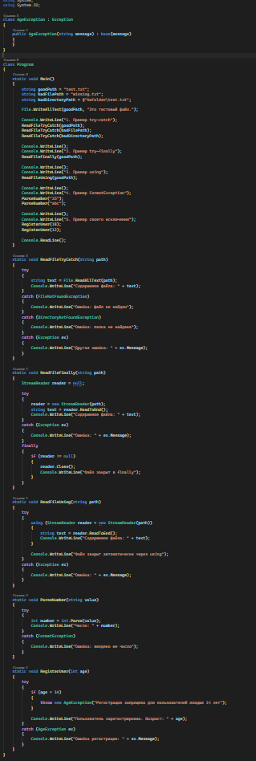
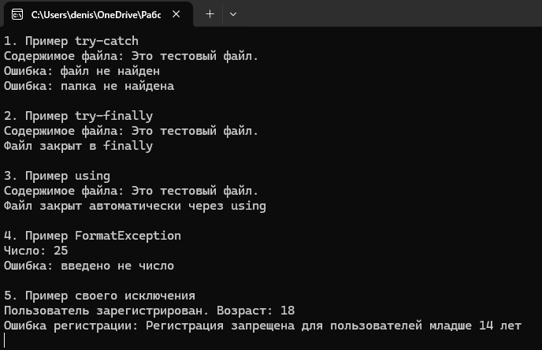

# C# KT4

Способы: try-catch, using и finally, свой класс исключений. 

Разобрать несколько примеров исключений.

На примере определенного кода разобрать основные пути решения проблем обработки исключений и сделать выводы по критериям: удобство, функциональность, читаемость.

### Код

### Результат

